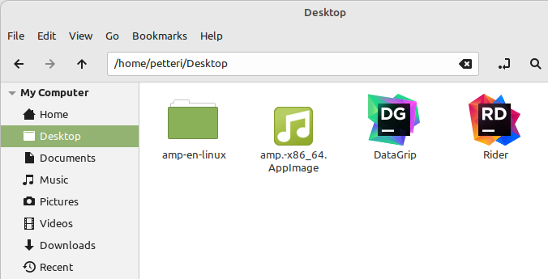
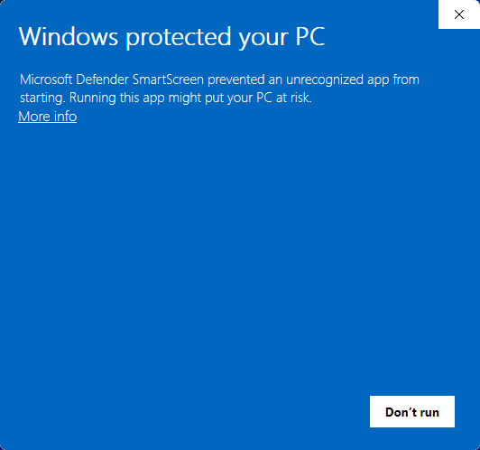
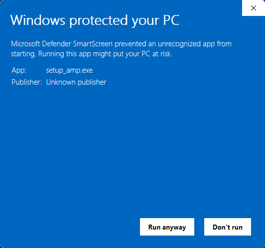
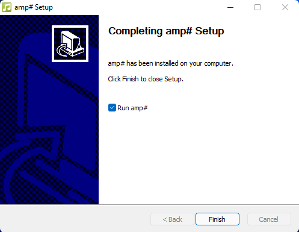
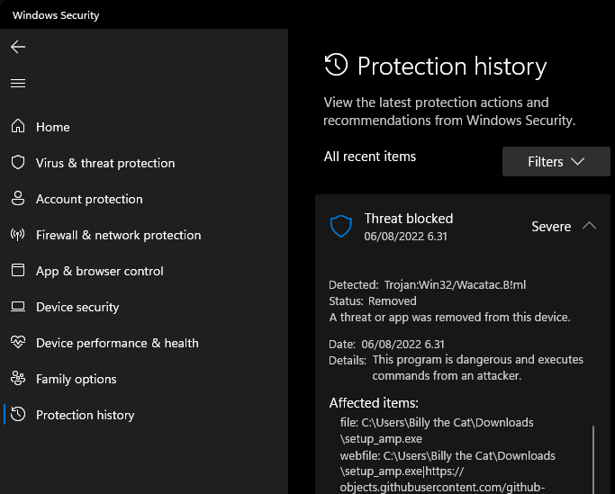
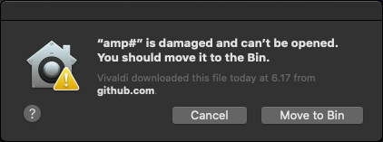
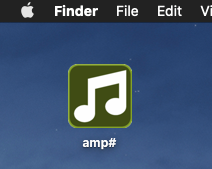

# General
The installation of the software needs some additional work as the software packages are not digitally signed, here are the OS-specific instructions.

# Linux install
1. Download the AppImage from [Releases](https://github.com/VPKSoft/amp-multi/releases)
2. Make the AppImage executable: `chmod +x chmod +x amp.-x86_64.AppImage`
3. Run the application: `./amp.-x86_64.AppImage`

## Dependencies
You might need to install [FUSE](https://github.com/AppImage/AppImageKit/wiki/FUSE): `sudo apt install libfuse2`

## AppImage desktop integration
For desktop integration, install the [AppImageLauncher](https://github.com/TheAssassin/AppImageLauncher/wiki). This enables the icon display, etc.

*This was tested on clean Ubuntu install (Ubuntu 22.04.1 LTS)*

# Windows install
1. Download `setup_amp.exe` installer from [Releases](https://github.com/VPKSoft/amp-multi/releases)
2. Run the installer, you will be prompted with this warning:

   

   *Select More info* 
   
   *Select Run anyway*

   

3. By default select

    * Next >
    * I Agree
    * Next >
    * Install
    * Next >
    * Finish

    

## Dependencies
[.NET 6](https://dotnet.microsoft.com/en-us/download) is required.

### Notes
No elevated privileges are required for the installation as the installer installs the software only for current user.

Additionally Windows Security needs to be allowed to run the file:

*Tested with Windows 11 Pro, OS build 21996.1, Windows Feature Experience Pack 321.14700.0.3*

# macOS install
1. Download the `amp.zip` zip package from [Releases](https://github.com/VPKSoft/amp-multi/releases)
2. Extract the zip package. You might get a notification suggesting moving the `amp.app` to Bin:

   

   *Select Cancel*
3. Run: `xattr -c amp\#.app/`
4. Now just start the application, this case it is extracted to desktop:

   

## Dependencies
[.NET 6](https://dotnet.microsoft.com/en-us/download) is required.

*This was tested on macOS Catalina Version 10.15.7 (19H15)*
