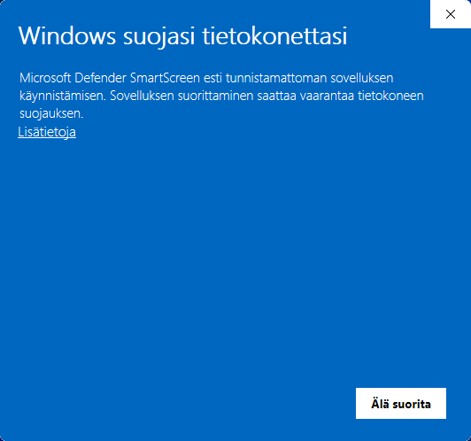
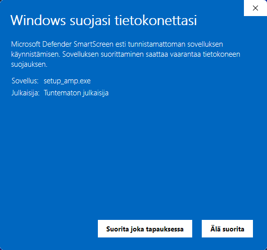
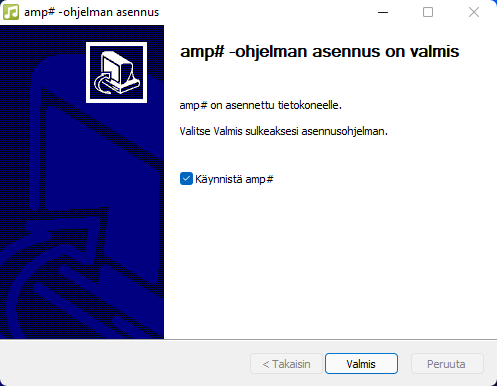
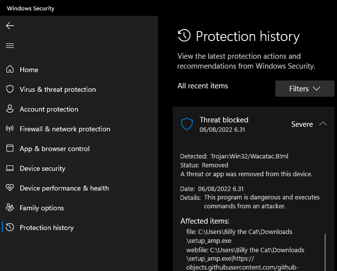
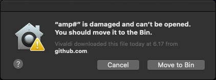
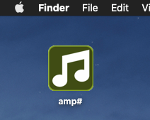

# Yleistä
Ohjelman asennus tarvitsee hiukan lisätyötä, koska ohjelmistoa ei ole digitaalisesti allekirjoitettu, tässä on ohjeet käyttöjärjestelmäkohtaiseen asennukseen.

# Linux-asennus
1. Lataa AppImage-paketti: [Releases](https://github.com/VPKSoft/amp-multi/releases)
2. Tee AppImage-paketista suoritettava: `chmod +x chmod +x amp.-x86_64.AppImage`
3. Suorita sovellus: `./amp.-x86_64.AppImage`

## Riippuvuudet
Tämän voi joutua asentamaan, että ohjelma toimisi [FUSE](https://github.com/AppImage/AppImageKit/wiki/FUSE): `sudo apt install libfuse2`

*Tämä asennusohje on testattu: Ubuntu (Ubuntu 22.04.1 LTS)*

# Windows-asennus
1. Lataa `setup_amp.exe`-asennusohjelma kohteesta [Releases](https://github.com/VPKSoft/amp-multi/releases)
2. Suorita asennusohjelma, saat luultavasti seuraavan varoituksen:

   

   *Valitse Lisätietoja* 
   
   *Valitse Suorita joka tapauksessa*

   

3. Oletusasennukseen valitse

    * Seuraava >
    * Hyväksyn
    * Seuraava >
    * Asenna
    * Seuraava >
    * Valmis

    

## Riippuvuudet
[.NET 6](https://dotnet.microsoft.com/en-us/download) tarvitaan.

### Huomioita
Korotettuja käyttöoikeuksia ei tarvita ohjelman asennukseen, koska asennusohjelma asentaa sovelluksen ainoastaan kirjautuneelle käyttäjälle.

Lisäksi Windowsin tietoturva saattaa vaatia asennusohjelman suorituksen sallimisen:

*Tämä asennusohje on testattu: Windows 11 Pro, OS build 21996.1, Windows Feature Experience Pack 321.14700.0.3*

# macOS-asennus
1. Lataa `amp.zip` zip-paketti sijainnista [Releases](https://github.com/VPKSoft/amp-multi/releases)

2. Pura zip-paketti. Voit saada ilmoituksen, joka kehottaa `amp.app`-sovelluksen siirtämisestä to Koriin:

    

    *Valitse peruuta*

3. Suorita: `xattr -c amp\#.app/`

4. Nyt riittää, kun käynnistät sovelluksen, tässä tapauksessa se on purettu työpöydälle:

    

## Riippuvuudet
[.NET 6](https://dotnet.microsoft.com/en-us/download) tarvitaan.

*Tämä asennus on asennusohje: macOS Catalina Version 10.15.7 (19H15)*
